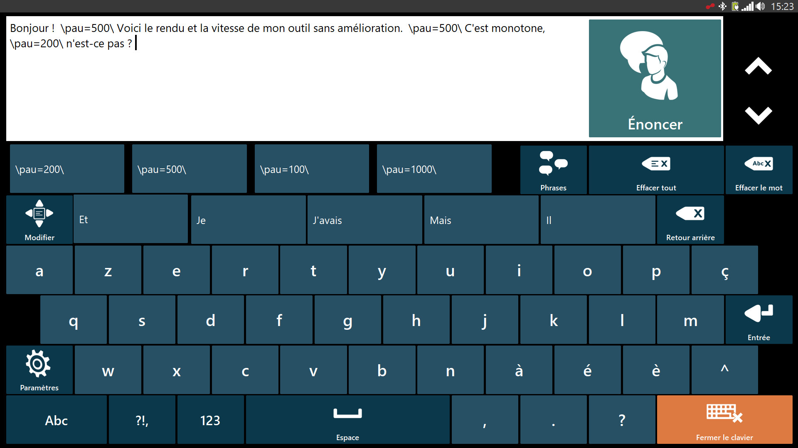

# The Pause App

The repository hosts the source code for the "Pause" Python app built for Philippe Aubert during the [TOM FRANCE](https://www.tomfrance.fr/) Hackathon on July 8th-9th 2024.

## Functions

### A better files navigation
The Pause app allows the user to navigate in their local files from the Communicator 5 Text Files storage using keyword search and sorting by date of last modification. The text files are displayed on a side window.

Here is the existing interface: 

With the Pause app, the user can leverage the tabs "Fichiers récents" and "mot-clé" to respectivally display the most recent files and search results by keywords. Here is the new interface:

### Pause tags automation
The Pause app also lets the user automatically add appropriate pause tags to make the output of the Tobii text-to-speech utility from Communicator 5 more fluid.

Here is the text where the pause tags (/pau=200/) have been automatically added:

## Important notes and issues

All files paths are hardcoded for use on Philippe's computer.

The .exe is not signed, so you will get a security warning from Windows when opening the app on Windows.

On Communicator 5 on Philippe's tablet version, opening an external program from a Communicator Home Screen shortcut seems to automatically trigger TD Control, which is inconvenient to use for Philippe.

Modified files including the pause tags are saved locally.

## How to Edit to App and update it on Philippe's computer

When you push a commit to main, the Github CI/CD triggers the build of the executable files for all platforms. For Philippe's computer, use  `GUI_Philippe_windows-latest.exe`. You can find under the Actions tab, clicking on the latest commit and scrolling down.

You can download this .exe on Philippe's computer and run it to get the app. Replace the previous version so that the Communicator 5 Home Screen shortcut points to the latest version of the .exe.
